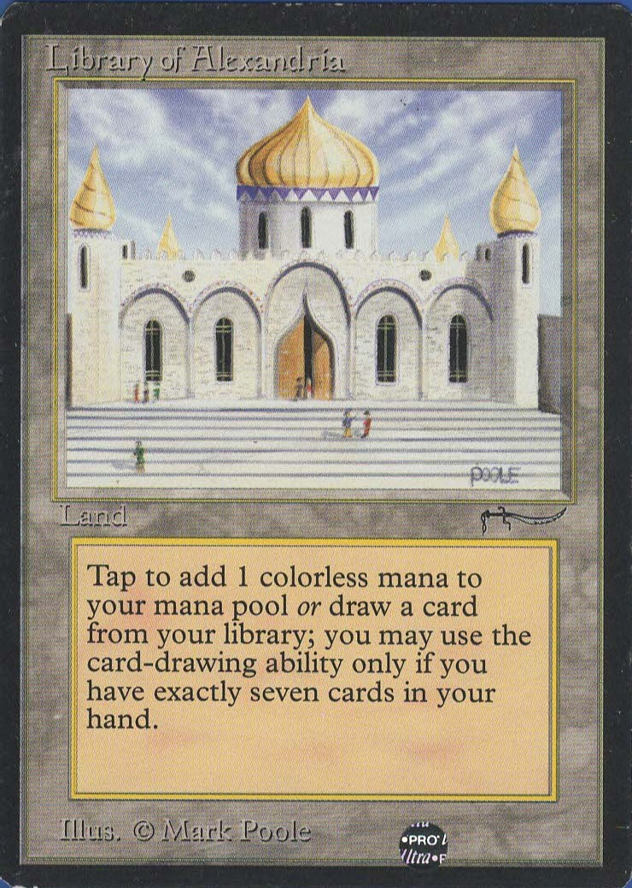

# LibraryOfAlexandriaForMTG
This is a individual project for the course Enterprise Java in MATC. This project is to create an inventory application for Magic the Gathering collectible cards.

### Problem Statement

"Magic: The Gathering (MTG; also known as Magic) is a trading card game 
created by Richard Garfield. First published in 1993 by Wizards of the Coast,
 Magic was the first trading card game produced and it continues to thrive, 
 with approximately twenty million players as of 2015." -- Wikipedia
 
Millions of players/collectors have accumulated cards over 24 years 
with 
varying
 degree of value that begs a library to hold and organize them. Key features 
 will be the ability to enter, search, update, delete and categorized cards 
 in a personal 
 collection. Estimate price valuation will be given to each card and 
 collection as additional information. 

Sample card of the project namesake (currently valued starting from $300 - 
$700):

### Project Technologies/Techniques 

* Security/Authentication
  * Admin role: create/read/update/delete (crud) of all data
  * User role: submit trail reports
  * All: anyone can view trail information (no login)
* Database (MySQL and Hibernate)
  * Store users and roles
  * Store magic card collection and price
  * Store magic card information
* Web Services or APIs
  * TBD API for all existing cards with or without picture. 
  * TBD API for price of all existing cards.
* Logging
  * Configurable logging using Log4J. In production, only errors will normally be logged, but logging at a debug level can be turned on to facilitate trouble-shooting. 
* Site and database hosted on AWS
* Unit Testing
  * JUnit tests to achieve 80% code coverage

### Design

* [Screen Design](DesignDocuments/Screens.md)
* [Application Flow](DesignDocuments/applicationFlow.md)
* [Database Design](DesignDocuments/MTG DB Model.png)

### [Project Plan](ProjectPlan.md)

### [Time Log](TimeLog.md)
